# Passion
**Passion** is a modern, lightweight browser game engine for TypeScript, inspired by [Pyxel](https://github.com/kitao/pyxel) but designed from the ground up for web development. Passion provides a clean, modular API that makes it easy to build retro-style 2D games with minimal setup and maximum control.

```bash
npm install @dmitrii-eremin/passion-engine
```

Passion is designed for rapid prototyping and educational use, with a focus on clarity, hackability, and fun. The engine is fully written in TypeScript, making it type-safe and easy to extend. All rendering is done on a single HTMLCanvasElement, and the engine is dependency-free, running in any modern browser.

Whether you're making a jam game, a teaching demo, or a nostalgic pixel adventure, Passion gives you the tools to get started quickly and iterate fast. Explore the API below to see how each subsystem works and how yo\u can use them together to build your own games.

## Inspiration
Built with inspiration from Pyxel, but tailored for TypeScript developers.

## Features

- Lightweight and easy to use
- Designed for rapid prototyping
- Runs in modern browsers

## Try examples
All examples are simple, self-contained, and designed to demonstrate specific features or subsystems of the engine. You can find them in the [https://github.com/dmitrii-eremin/passion-ts/tree/main/src/game/examples](https://github.com/dmitrii-eremin/passion-ts/tree/main/src/game/examples) of the repository. Each example is easy to run and modify, making them ideal for learning, experimentation, or as a starting point for your own projects.

**Also you can try them out right in your BROWSER right NOW!**
https://dmitrii-eremin.github.io/passion-ts/

<a href="../src/game/examples/01_hello_passion.ts">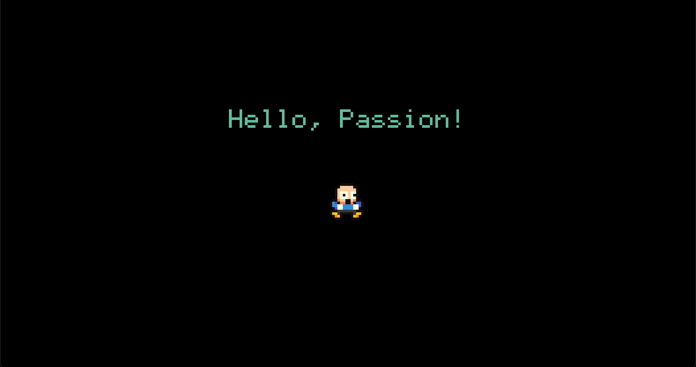</a>
<a href="../src/game/examples/05_perlin_noise.ts">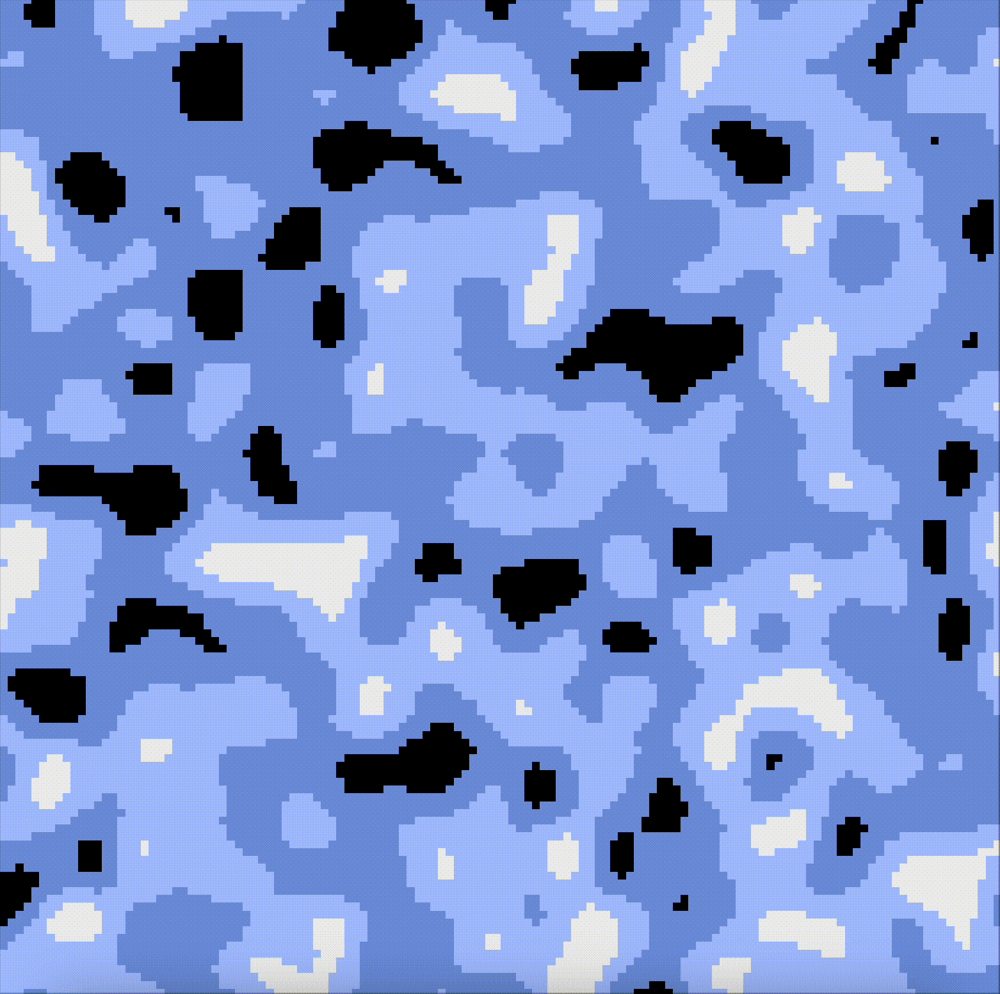</a>
<a href="../src/game/examples/08_tiled_map.ts">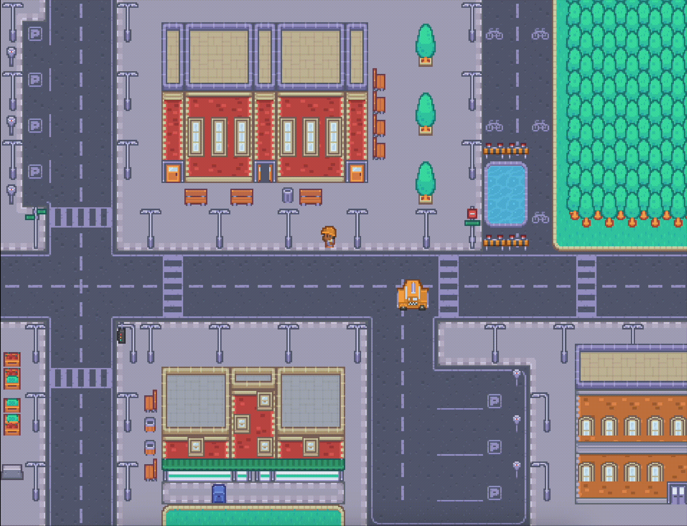</a>
<a href="../src/game/examples/06_snake_game.ts">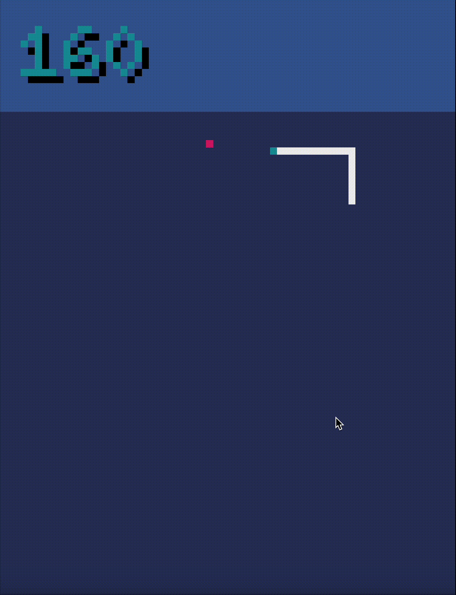</a>
<a href="../src/game/examples/03_draw_api.ts">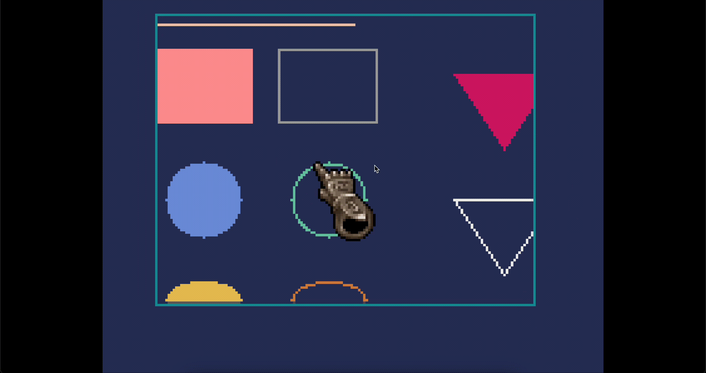</a>
<a href="../src/game/examples/10_collisions.ts">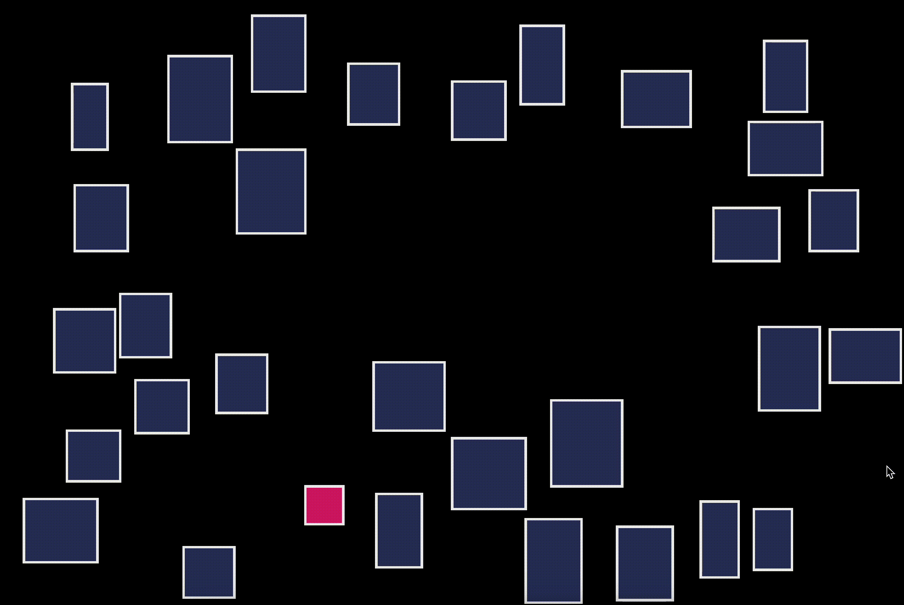</a>
<a href="../src/game/examples/04_font_api.ts">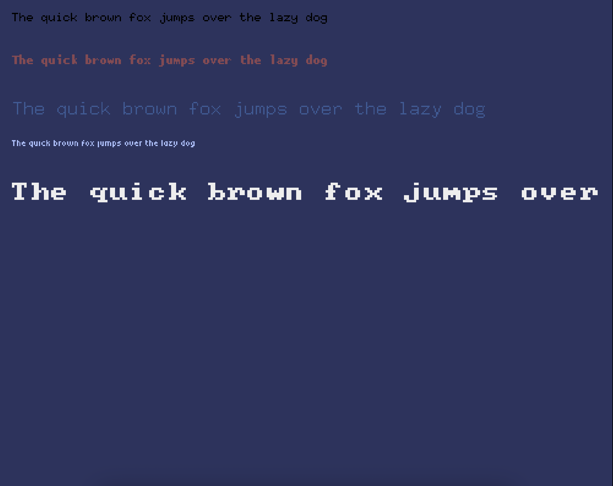</a>
<a href="../src/game/examples/09_sound_api.ts">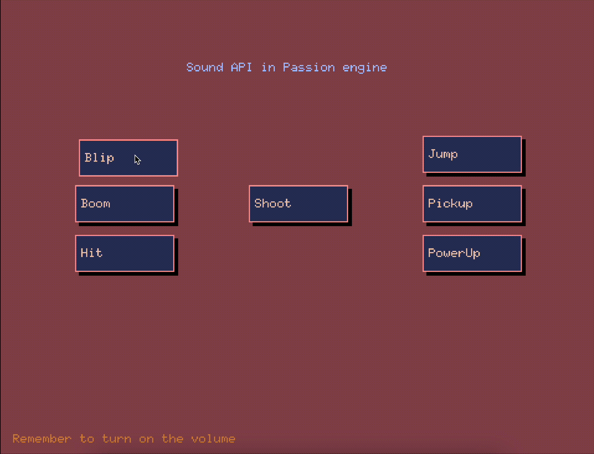</a>
<a href="../src/game/examples/07_color_palette.ts">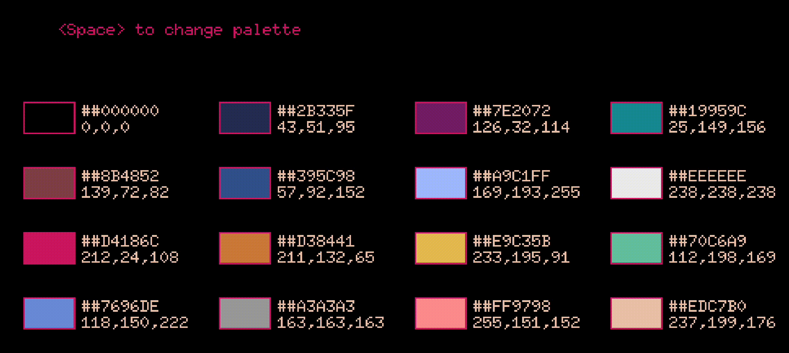</a>
<a href="../src/game/examples/11_offscreen_rendering.ts">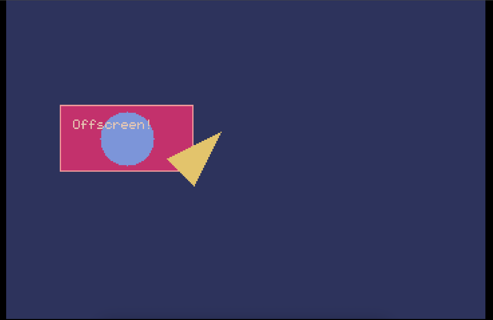</a>

## Palette
Passion uses exactly the same palette as pyxel engine. But you can change it anyhow you'd like.
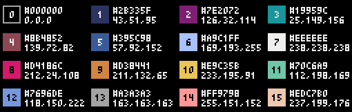

# Documentation
The latest documentation is always available in this readme file, or you can browse it online at [https://passion-ts.readthedocs.io/en/latest/](https://passion-ts.readthedocs.io/en/latest/).

## API Reference

* [Passion](./passion/passion.md) — the entry point for all API functions in the engine.
  * [ISystem](./passion/system.md) — Core game loop, window, and timing management.
  * [IResource](./passion/resource.md) — Image, sound, font, and canvas loading and resource management.
  * [IGraphics](./passion/graphics.md) — Drawing, palette, and rendering functions for 2D graphics.
  * [IInput](./passion/input.md) — Keyboard, mouse, and touch input handling.
    * [IKeys](./passion/keys.md) — Key codes and keyboard mapping reference.
  * [IMath](./passion/math.md) — Math helpers, random numbers, and noise generation.
  * [IAudio](./passion/audio.md) — Sound playback and audio control.
  * [INetwork](./passion/network.md) — WebSocket networking for multiplayer and online games.
  * [IStorage](./passion/storage.md) — Unified API for LocalStorage, SessionStorage, Cookies, and IndexedDB.
* StdLib - a set of useful helpers to extend the main engine
  * [Animation](./stdlib/animation.md) — Animation utilities for sprite and frame-based animation.
  * [Tween](./stdlib/tween.md) — Tweening and Easing Utility API Reference
  * [Position](./stdlib/position.md) — 2D position utility class.
  * [Size](./stdlib/size.md) — 2D size utility class.
  * [Rect](./stdlib/rect.md) — 2D rectangle utility class.
  * [Tiled](./stdlib/tiled.md) — Load and render .tmx tilemaps (Tiled).

Passion also includes a standard library (stdlib) with additional helper classes, as listed above, to further support your game development needs.

# Getting started

Here's a minimal example to get you started with Passion:

```ts
import { Passion } from './passion/passion';

// Get your canvas element
const canvas = document.getElementById('app') as HTMLCanvasElement;

// Create the engine
const passion = new Passion(canvas);

// Initialize the system (width, height, title, scale)
passion.system.init(240, 180, 'My Passion Game', 3);

// Load resources
const imageIndex = passion.resource.loadImage('./cat_16x16.png');
const soundIndex = passion.resource.loadSound('./Jump1.wav');
const fontIndex = passion.resource.loadFont(bdfFontString); // BDF font string
const canvasIndex = passion.resource.createCanvas(128, 128); // Offscreen canvas

// Main update and draw functions
function update(dt: number) {
  // Game logic here
}

function draw() {
  passion.graphics.cls(0); // Clear screen with color 0
  passion.graphics.text(10, 10, 'Hello, Passion!', 7);
  passion.graphics.blt(50, 50, imageIndex, 0, 0, 16, 16); // Draw image
  passion.graphics.blt(100, 50, canvasIndex, 0, 0, 128, 128); // Draw offscreen canvas
}

// Start the game loop
passion.system.run(update, draw);
```

Make sure your HTML contains a canvas element with id `app`:

```html
<canvas id="app" width="240" height="180" tabindex="0"></canvas>
```

This will display a window, clear the screen, draw some text, and blit an image. You can expand on this by using the full API described below.

# Commercial Use and Royalties

Passion is free to use for personal, educational, and non-commercial projects. If you develop a game using this engine and your total revenue from that game exceeds 3000€ (three thousand euros), a royalty fee of 5% applies to the amount above this threshold.

**How does it work?**
- The first 3000€ you earn from your game is royalty-free.
- For any revenue above 3000€, you owe a 5% royalty on the excess amount.

**Example:**
If you earned 5000€ with a game you developed using Passion, the calculation would be:

- First 3000€: free
- Remaining: 5000€ - 3000€ = 2000€
- Royalty owed: 2000€ × 5% = 100€

If you have questions about royalties or need to arrange payment, please contact me by email.

# License
MIT