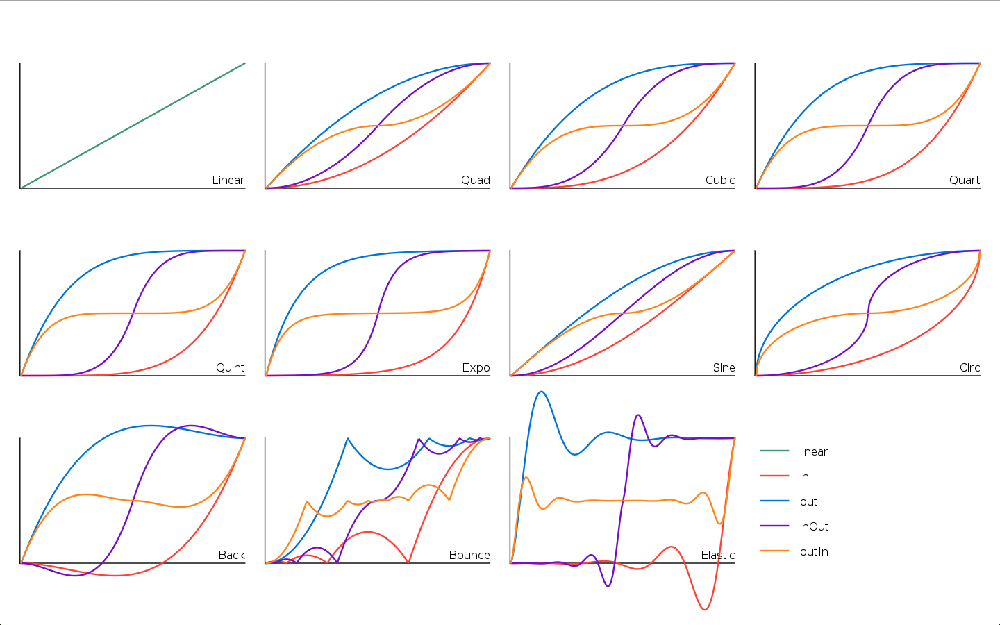

# Tween — Tweening and Easing Utility API Reference

The `Tween` class in Passion's standard library provides a flexible and expressive way to interpolate (tween) numeric properties of objects over time, using a wide variety of easing functions. This is essential for smooth animations, transitions, and effects in games and graphical applications. The API is designed for clarity, extensibility, and ease of use.

---

## Overview

A `Tween` object animates one or more numeric properties of a target object from their current values to specified target values over a given duration, using a chosen easing function. The library includes a comprehensive set of easing functions for different animation styles, all available via the `Easing` class.

---

## API Reference

### Class: `Tween`

#### Constructor
```typescript
constructor(object: TweenObject, target: Record<string, number>, duration: number, easing: EasingFunction)
```
- **object**: `TweenObject` — The object whose properties will be tweened.
- **target**: `Record<string, number>` — The target values for the properties to animate.
- **duration**: `number` — The duration of the tween in seconds.
- **easing**: `EasingFunction` — The easing function to use for interpolation.
- **returns**: `Tween` — A new Tween instance.

#### Instance Methods

##### `update(dt: number): boolean`
Advances the tween by `dt` seconds, updating the object's properties. Returns `true` if the tween has finished.
- **dt**: `number` — Time step in seconds.
- **returns**: `boolean` — `true` if the tween is complete, otherwise `false`.

---

### Class: `Easing`

The `Easing` class provides a wide range of static easing functions for use with tweens. Each function has the signature:
```typescript
(time: number, begin: number, change: number, duration: number): number
```
- **time**: `number` — Current time (seconds since start).
- **begin**: `number` — Starting value.
- **change**: `number` — Total change in value.
- **duration**: `number` — Total duration of the tween.
- **returns**: `number` — The interpolated value at the given time.

#### Easing Function Reference

Below are all available easing functions, grouped by type. The image below visualizes their curves:



##### Linear
- `linear` — Constant speed from start to finish.

##### Quadratic
- `inQuad` — Accelerates from zero velocity.
- `outQuad` — Decelerates to zero velocity.
- `inOutQuad` — Accelerates, then decelerates.
- `outInQuad` — Decelerates, then accelerates.

##### Cubic
- `inCubic` — Accelerates from zero velocity (stronger than quad).
- `outCubic` — Decelerates to zero velocity (stronger than quad).
- `inOutCubic` — Accelerates, then decelerates (cubic curve).
- `outInCubic` — Decelerates, then accelerates (cubic curve).

##### Quartic
- `inQuart` — Accelerates from zero velocity (even stronger).
- `outQuart` — Decelerates to zero velocity (even stronger).
- `inOutQuart` — Accelerates, then decelerates (quartic curve).
- `outInQuart` — Decelerates, then accelerates (quartic curve).

##### Quintic
- `inQuint` — Accelerates from zero velocity (strongest polynomial).
- `outQuint` — Decelerates to zero velocity (strongest polynomial).
- `inOutQuint` — Accelerates, then decelerates (quintic curve).
- `outInQuint` — Decelerates, then accelerates (quintic curve).

##### Sine
- `inSine` — Smooth acceleration from zero velocity (sinusoidal).
- `outSine` — Smooth deceleration to zero velocity (sinusoidal).
- `inOutSine` — Smooth acceleration and deceleration (sinusoidal).
- `outInSine` — Smooth deceleration, then acceleration (sinusoidal).

##### Exponential
- `inExpo` — Exponential acceleration from zero velocity.
- `outExpo` — Exponential deceleration to zero velocity.
- `inOutExpo` — Exponential acceleration, then deceleration.
- `outInExpo` — Exponential deceleration, then acceleration.

##### Circular
- `inCirc` — Circular acceleration from zero velocity.
- `outCirc` — Circular deceleration to zero velocity.
- `inOutCirc` — Circular acceleration, then deceleration.
- `outInCirc` — Circular deceleration, then acceleration.

##### Elastic
- `inElastic` — Elastic bounce at the beginning. (Optional: `amplitude`, `period`)
- `outElastic` — Elastic bounce at the end. (Optional: `amplitude`, `period`)
- `inOutElastic` — Elastic bounce at both ends. (Optional: `amplitude`, `period`)
- `outInElastic` — Elastic bounce in the middle. (Optional: `amplitude`, `period`)

##### Back
- `inBack` — Overshoots slightly at the beginning. (Optional: `overshoot`)
- `outBack` — Overshoots slightly at the end. (Optional: `overshoot`)
- `inOutBack` — Overshoots at both ends. (Optional: `overshoot`)
- `outInBack` — Overshoots in the middle. (Optional: `overshoot`)

##### Bounce
- `inBounce` — Bounce effect at the beginning.
- `outBounce` — Bounce effect at the end.
- `inOutBounce` — Bounce at both ends.
- `outInBounce` — Bounce in the middle.

---

## Example Usage

```typescript
import { Tween, Easing } from 'passion/stdlib/tween';

// Animate an object's x and y to (100, 200) over 1 second with cubic ease-out
type MyObject = { x: number; y: number };
const obj: MyObject = { x: 0, y: 0 };
const tween = new Tween(obj, { x: 100, y: 200 }, 1, Easing.outCubic);

// In your game loop:
function update(dt: number) {
    if (!tween.update(dt)) {
        // Tween is still running
    } else {
        // Tween finished
    }
}
```

---

## Design Philosophy

- **Comprehensive**: Includes all major easing types for animation.
- **Flexible**: Works with any object and any numeric properties.
- **Reusable**: Designed for use throughout the engine and user code.

---

For more details on animation and tweening, see the [Passion engine documentation](../index.md).
